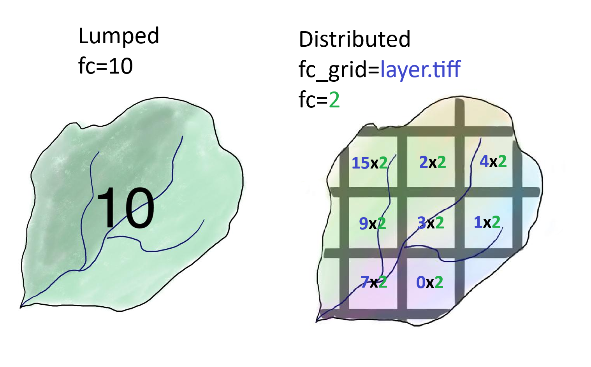

**************
Control file (Configuration file)
**************
The configuration file controls all user-adjustable settings for EF5, including input forcings, output options, and run methods. It is generally case **insensitive** (except for file paths on case-sensitive systems). Three styles of comments are supported: bash (#), C (/* */), and C++ (//).

This is an example of comments in the control file:

.. code-block:: ini

   # All variables (except file paths) are case insensitive
   // Multiple comment types are supported
   /*
      Including multi-line C-style comments
   */

Format and taxonomy information
=====
Tiff files requirements:

#. -9999 as nodata value.
#. No TILED format.
#. `float32` data type.
#. The ESRI flow direction convention must be restricted to the following values: **1, 2, 4, 8, 16, 32, 64, and 128**.

About time taxonomy
----------------

EF5 uses a time taxonomy to define the simulation period and timestep. The time format is specified in the configuration file, allowing for flexible simulation periods. This time taxonomy is also used in the precipitation and PET forcing files names.

.. confval:: TIMESTEP, TIME_BEGIN, TIME_END and tiff-file names

      Simulation timing parameters. The timestep is the time interval for the simulation, and the begin and end times define the simulation period.
      
      The time format is YYYYMMDDHHUU, where ``YYYY`` is the year, ``MM`` is the month, ``DD`` is the day, ``HH`` is the hour, and ``UU`` is the minute.
      
      For time step, where ``d`` is for day step, ``h`` is for hour step, and ``u`` is for minute step.

Blocks
=====

The control file is structured into blocks, each containing key-value pairs. Each block is defined by a header in square brackets, and the key-value pairs are separated by an equals sign (`=`).

Basic block
----------------

Specifies file locations for the digital elevation model (DEM), drainage direction map (DDM), and flow accumulation map (FAM).

.. code-block:: ini

   [Basic]
   DEM=/EF5Demo/FF/basic/DEM.asc
   DDM=/EF5Demo/FF/basic/DDM.asc
   FAM=/EF5Demo/FF/basic/FAM.asc
   PROJ=laea
   ESRIDDM=true
   SELFFAM=true

Precipitation block
----------------
Defines the properties of the precipitation forcing files. EF5 considers the indicated layer units to be consistent with the simulation timestep.

.. code-block:: ini

   [PrecipForcing Q2Precip]
   TYPE=BIF
   UNIT=mm/h
   FREQ=5u
   LOC=/EF5Demo/FF/precip
   NAME=Q2_YYYYMMDDHHUU.bif

Potential Evapotranspiration (PET) block
----------------
Defines the PET forcing file details. EF5 considers the indicated layer units to be consistent with the simulation timestep.

.. code-block:: ini

   [PETForcing PET]
   TYPE=BIF
   UNIT=mm/h
   FREQ=m
   LOC=/EF5Demo/FF/pet
   NAME=PET_MM.bif

Gauge locations block(s)
------------------------
Each gauge information is defined in a separate block, with the block name being the gauge identifier. The gauge identifier is used to reference the gauge in other blocks, such as the basin block.
The gauge location block specifies the locations of gauges for output and parameter assignment. ``OUTPUTTS`` is an optional parameter that, when set to `TRUE`, indicates that the gauge will output time series data. ``OBS`` is an optional parameter that specifies the path to the observed data file for the gauge. ``OBS`` is required if the gauge will be used for calibration task. The ``BASINAREA`` parameter is also optional and indicates the area of the basin in square kilometers. When ``BASINAREA`` is indicated, EF5 will compare the basin area with the area of the flow accumulation map (FAM) to ensure they match. If they do not match, EF5 will look for nearest flow accumulation within a threshold. If no match is found, EF5 will raise a warning.

.. indicate the other option for gauge area and lat and lon

.. code-block:: ini

   [Gauge OKC]
   LON=-97.01
   LAT=35.68
   OBS=/EF5Demo/obs/okc.csv
   BASINAREA=341.88
   OUTPUTTS=TRUE

   [Gauge AR]
   LON=-93.62
   LAT=34.37

Basin block(s)
----------------
Groups gauge locations into basins. The user can define multiple basins, each with its own set of gauges. This block doesn't follow the classic basin definition, but rather groups gauges that are required by the user for a specific task. The basin block is used to define the basin name and the gauges that belong to it. The basin name is used to reference the basin in other blocks, such as the task block.

.. code-block:: ini

   [Basin FF]
   GAUGE=OKC
   GAUGE=AR

Parameter Sets
==============

The `gauge` parameter specifies the gauge identifier for which the parameters are defined. The user must specify at least the set of parameters for one gauge and use them for the entire domain, or can specify parameters for multiple gauges in the same block.

.. _lumped distributed:

.. admonition:: There are two ways to define parameters for a basin:
   
   #. **Lumped (aggregated) parameter sets:** Each parameter corresponds to a single (scalar) value. This is the traditional way of defining parameters for hydrological models.
   #. **Distributed (grided) parameter sets:** Parameters are defined in a grid format, where each parameter corresponds to a grid file. Grided parameters could be identified by `_grid` suffix in the parameter name. After the grided files are defined, the user must specify the parameters multiplier values for each grid, using the lumped parameter name without the `_grid` suffix.
   
   Additional information about the parameters definition and units could be found in the `calibration` section.

   Guidance on how to interpret lumped and distributed parameters.

Hydrologic Water Balance Models
--------------------------

The listed water balance models are explained in detail in the :ref:`water balance models section <water balance models>`.

#. CREST Parameter Set
#. SAC-SMA Parameter Set

Routing Models
--------------------------

The listed routing models are explained in detail in the :ref:`routing models section <routing models>`.

#. Linear Reservoir Parameter Set
#. Kinematic Wave Parameter Set

Snow-17 Parameter Set
=====================

Defines the parameters for the Snow-17 model.

.. code-block:: ini

   [snow17paramset tarbela]
   GAUGE=tarbela
   UADJ=0.184653
   MBASE=0.047224
   MFMAX=1.068658
   MFMIN=0.516059
   TIPM=0.911706
   NMF=0.077336
   PLWHC=0.093812
   SCF=2.219492

Full control file example
=====================

This is a full EF5 control file example for a basic simulation using the CREST model. It includes the basic block, precipitation forcing, PET forcing, gauge locations, basin definition, parameter set for CREST, and a task to run the simulation.

.. toggle::

   .. code-block:: ini

      [Basic]
      DEM=/EF5Demo/FF/basic/DEM.asc
      DDM=/EF5Demo/FF/basic/DDM.asc
      FAM=/EF5Demo/FF/basic/FAM.asc
      PROJ=laea
      ESRIDDM=true

      [PrecipForcing Q2Precip]
      TYPE=BIF
      UNIT=mm/h
      FREQ=5u
      LOC=/EF5Demo/FF/precip
      NAME=Q2_YYYYMMDDHHUU.bif

      [PETForcing PET]
      TYPE=BIF
      UNIT=mm/h
      FREQ=m
      LOC=/EF5Demo/FF/pet
      NAME=PET_MM.bif

      [Gauge OKC]
      LON=-97.01
      LAT=35.68
      OBS=/EF5Demo/obs/okc.csv

      [Gauge AR]
      LON=-93.62
      LAT=34.37

      [Basin FF]
      GAUGE=OKC
      GAUGE=AR

      [CrestParamSet FF]
      GAUGE=AR
      COEM=24.230076 EXPM=0.502391 RIVER=1.73056
      UNDER=0.291339 LEAKO=0.56668 LEAKI=0.251648
      TH=63.20205 GM=1.364364 PWM=71.96465
      PB=0.964355 PIM=6.508687 PKE=0.19952
      PFC=2.578529 IWU=53.52593 ISO=5.899539
      ISU=17.31128
      GAUGE=OKC
      COEM=24.230076 EXPM=0.502391 RIVER=1.73056
      UNDER=0.291339 LEAKO=0.56668 LEAKI=0.251648
      TH=63.20205 GM=1.364364 PWM=71.96465
      PB=0.964355 PIM=6.508687 PKE=0.19952
      PFC=2.578529 IWU=53.52593 ISO=5.899539
      ISU=17.31128

      [Task RunFF]
      STYLE=SIMU
      MODEL=CREST
      BASIN=FF
      PRECIP=Q2_PRECIP
      PET=PET
      OUTPUT=/EF5Demo/FF/output/
      OUTPUT_GRIDS=MAXUNITSTREAMFLOW|MAXSTREAMFLOW|PRECIPACCUM|INUNDATION|MAXINUNDATION # Refer to 
      PARAM_SET=FF
      TIMESTEP=5u
      TIME_BEGIN=201006010000
      TIME_END=201006010030

      [Execute]
      TASK=RunFF