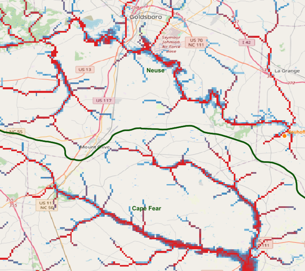
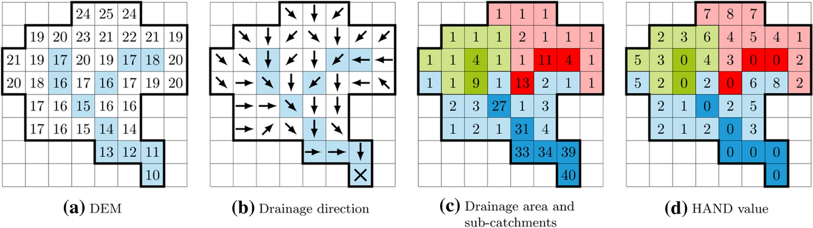

Inundation Models
=================

Simple Inundation (HAND method)
-------------------------------

Height Above Nearest Drainage (HAND) method proposed by `Rennó et al. (2008) <https://www.sciencedirect.com/science/article/pii/S003442570800120X>`_, considers relative flow depth to fill a hydro-conditioned DEM. The methodology could be used to obtain quick results, but has some limitations as the listed ones `(Aristizabal et al., 2023) <https://agupubs.onlinelibrary.wiley.com/doi/full/10.1029/2022WR032039>`_:

•	Doesn’t consider pluvial, coastal, ground water, and dam break components among other possible.
•	Inundation proxy or no physics model.
•	Requires all areas eligible for inundation to drain to the designated drainage network (Hydro-conditioning).
•	Higher resolutions can lack sufficient representation of fine grain features such as embankments, flood walls, and closure structures.

The following figure illustrates the implementation of the HAND methodology using EF5.

   
   Water depth (.tif) output using EF5. The arbitrary color ramp represents the water depth for the simulated event.

The following figure briefly illustrates the implementation concept of HAND.

   
   HAND methodology implementation, from `(Rebolho et al., 2018) <https://hess.copernicus.org/articles/22/5967/2018/>`_

Simple Inundation Parameter Set
~~~~~~~~~~~~~~~~~~~~~~~~~~~~~~~

Defines the parameters for the simple inundation model. The parameters `alpha` and `beta` are used to define the coefficients for the rating curve power function, which is used to calculate the flow depth from the simulated flow rate.

.. confval:: PARAMETERS FOR INUNDATION
 
   ``gauge``: Gauge ID as defined in the BASIN block.
   
   ``alpha``: Lumped parameter for the rating curve alpha*(discharge)^beta. If using distributed parameters, it will work as a multiplier factor for the grid values.
   
   ``beta``: Lumped parameter for the rating curve alpha*(discharge)^beta. If using distributed parameters, it will work as a multiplier factor for the grid values.

   ``th_fim``: Flow accumulation threshold to estimate the inundation area. This parameter is independent of the routing model threshold ``th``. v 1.2.6 and later. Previous versions use the ``th`` parameter as the threshold for inundation.

   **Optional parameters:**

   ``alpha_grid``: Path for the grid of alpha parameter (.tif) for the rating curve alpha*(discharge)^beta. It must be accompanied by the ``alpha`` parameter, which will work as a multiplier factor for the grid values.

   ``beta_grid``: Path for the grid of beta parameter (.tif) for the rating curve alpha*(discharge)^beta. It must be accompanied by the ``beta`` parameter, which will work as a multiplier factor for the grid values.

.. confval:: OUTPUT GRIDS

   ``MAXINUNDATION``: Maximum inundation depth (m) for the simulation period. (v 1.2.4 and later)
   
   ``INUNDATION``: Inundation depth (m) at each time step.

   ``HANDCATCHMENT``: HAND catchment areas (v 1.2.6 and later)

Example of Simple Inundation control file

.. code-block:: ini

   ...

   [simpleinundationparamset rundufim]
   gauge=rundu
   alpha_grid=parameters/alpha_fim_rundu.tif
   beta_grid=parameters/beta_fim_rundu.tif
   alpha=1                    # Multiplier factor for the grided parameter
   beta=1                     # Multiplier factor for the grided parameter
   th_fim=1000                # v 1.2.6 and later

   [Task SimulationRundu]
   ...
   inundation=simpleinundation
   inundation_param_set=rundufim
   output_grids=INUNDATION|MAXINUNDATION|HANDCATCHMENT
   ...

   [Execute]
   TASK=SimulationRundu