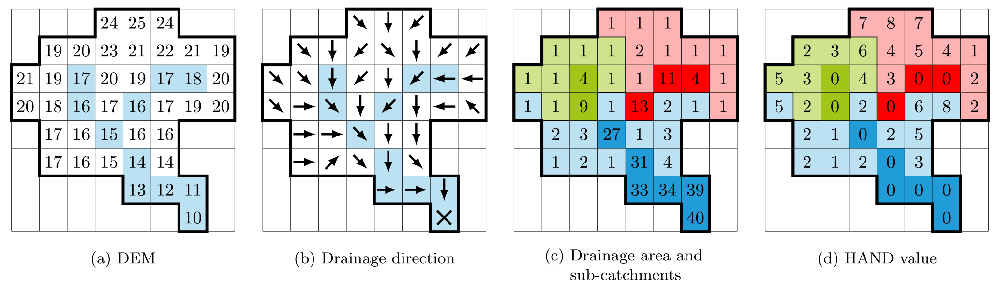

Inundation Models
-----------------

Simple Inundation using HAND
~~~~~~~~~~~~~~~~~

Height Above Nearest Drainage (HAND) method proposed by Rennó et al. (2008), considers relative flow depth to fill a hydro-conditioned DEM. The methodology could be used to obtain quick results, but has some limitations as the listed ones (Aristizabal et al., 2023):

•	Doesn’t consider pluvial, coastal, ground water, and dam break components among other possible.
•	Inundation proxy or no physics model.
•	Requires all areas eligible for inundation to drain to the designated drainage network (Hydro-conditioning).
•	Higher resolutions can lack sufficient representation of fine grain features such as embankments, flood walls, and closure structures.

The following Figure briefly shows the HAND methodological procedure.

Figure. HAND methodology implementation, from (Li et al., 2022).